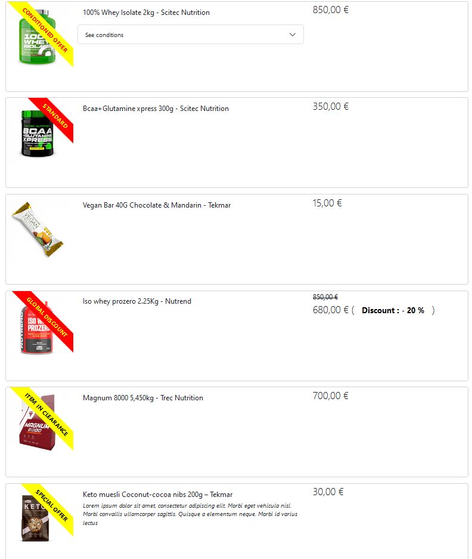

# Simple implementation of the CoR using Symfony

## Installation

after cloning this project, please run `docker compose build` and next `docker compose up -d`.

finally, when all containers are correctly installed, plus run the `docker compose exec backend bash`
to get into the main container. once in the backend container, you can run the following commands :

- `composer self-update` : to update the composer software

- `composer install` : to install components and dependencies

finally, you can run the project on http://localhost:9595/price to get this page



## Description

the Chain of resolvers is initialized by a CompilerPass
see `src/DependencyInjection/Compiler/PromotionResolverPass.php`.

each promotion resolver lies in `src/Service/Promotion/Resolver/Promotion` and must implement
the `Service/Promotion/Resolver/PromotionResolverInterface` interface or extends
the `Service/Promotion/Resolver/AbstractPromotionResolver` class.

because the chained resolvers must be sorted by priority, the configuration must be set in the `config/services.yaml`
file like the following

```
    App\Service\Promotion\Resolver\Promotion\SpecialDiscountResolver:
        tags:
            - { name: 'promotion_resolver', priority: 400 }

    App\Service\Promotion\Resolver\Promotion\GlobalDiscountResolver:
        tags:
            - { name: 'promotion_resolver', priority: 300 }

    App\Service\Promotion\Resolver\Promotion\PromotionResolver:
        tags:
            - { name: 'promotion_resolver', priority: 200 }

    App\Service\Promotion\Resolver\Promotion\ClearancePromotionResolver:
        tags:
            - { name: 'promotion_resolver', priority: 100 }

    App\Service\Promotion\Resolver\Promotion\SpecialOfferPromotionResolver:
        tags:
            - { name: 'promotion_resolver', priority: 50 }
```

if one reference has 2 promotions at the same time, the promotion with a higher priority is taken into effect.

the processor `Service/Promotion/Processor/PromotionProcessor` handles an array of references (
see `Controller/PriceController.php`)

```
$prices = $erpService->getPrices([]);

$resolvedReferences = $processor->resolvePromotion($prices['references']);
```

to render every each reference's template as expected, another Twig extension is created to manage Reference
objects : `Twig/Promotion/Extension/Runtime/LazyPromotionExtension`.

a renderer is an object that implements `Service/Promotion/Renderer/ReferenceRendererInterface` interface or simply
extends `Service/Promotion/Renderer/AbstractReferenceRenderer` class.

the priority of each render is defined with the `protected static int $priority` property which defaults to 0. if the
render has a higher priority and supports a specific reference (condition to set define in the `supports()` method).

each renderer will be tagged with `promotion_renderer` tag. those renderers are added to a service locator and used when
rendering the references with `renderReference(reference)` Twig function.

when no renderer is defiend for a sepecific reference / promotion, the default renderer will be
used `Service/Promotion/Renderer/Reference/RegularReferenceRenderer`.

## Manage new promotion

in case a new Promotion is to be developed:

- add a new resolver for (e.g `Service/Promotion/Resolver/Promotion/FooResolver`)
    - define its condition and how to create the Reference instance.
- if a custom templates is to be used with this exact promotion, you need to
    - create a template (like `templates/price/web_price.html.twig`)
    - extend it from a specific template (either `templates/price/default_reference.html.twig` or
      `templates/price/promoted_reference.html.twig` if you need to add the ribbon)
    - you can keep use of the `templates/price/promoted_reference.html.twig` only if no need to override anything.
- if needed, you can create a renderer for this type of promotion and specify the right template to use with the
  `Service/Promotion/Renderer/ReferenceRendererInterface::getTemplatePath()` method. otherwise, you can simply extend
  the `Service/Promotion/Renderer/Reference/AbstractPromotionSupport` to use only
  `templates/price/promoted_reference.html.twig`.